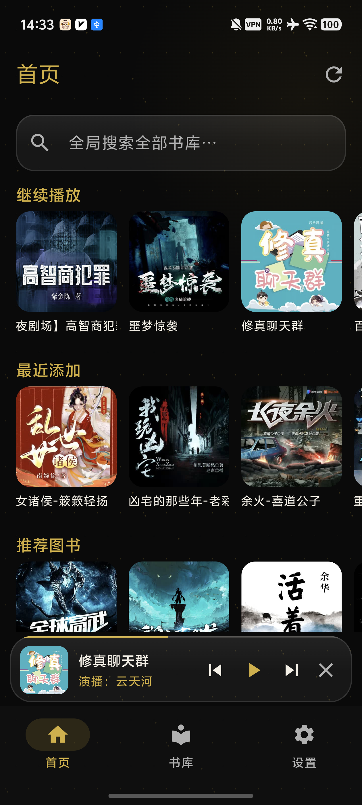
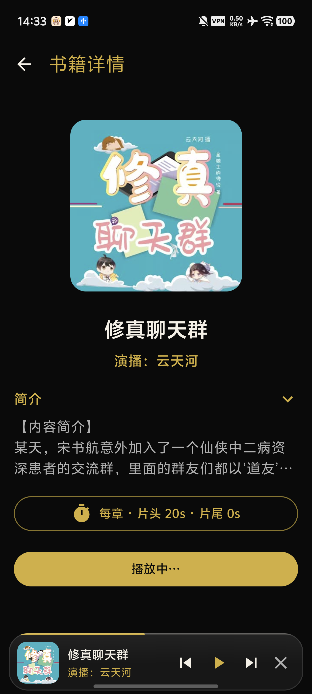
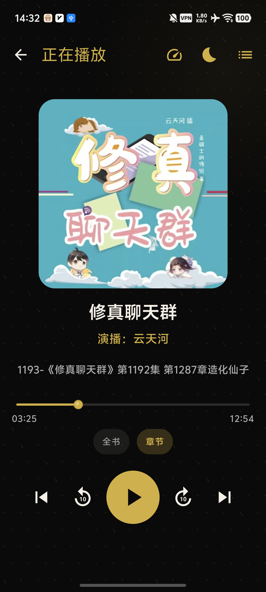
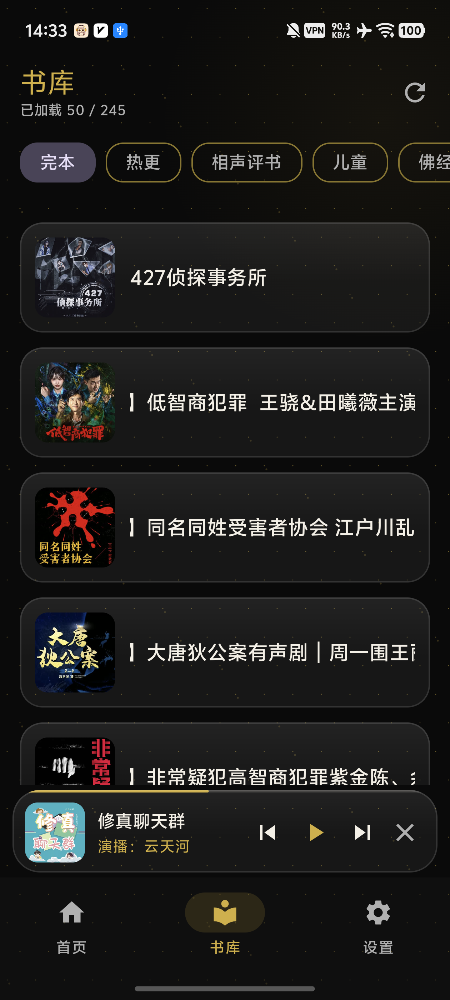
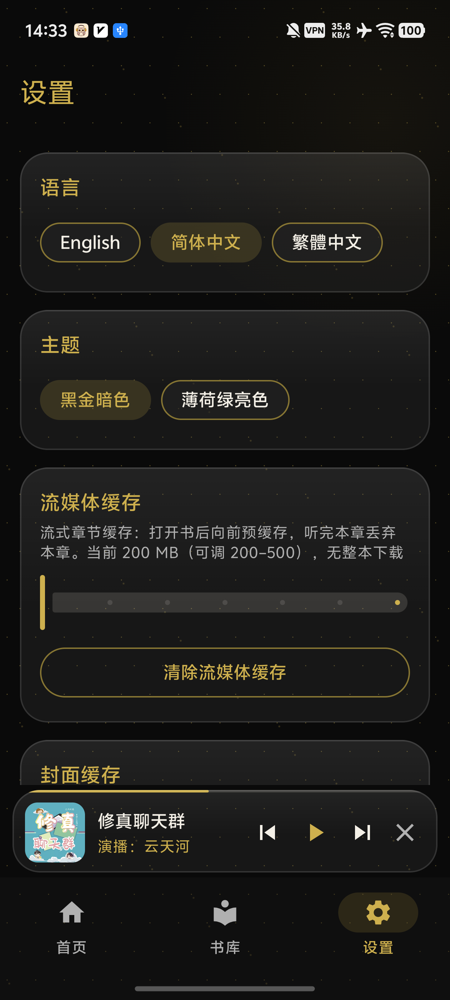

# YueErShengYue

<p align="center">
  <strong>English</strong> · <a href="README.zh-CN.md">简体中文</a>
</p>

**YueErShengYue** is an [Audiobookshelf](https://www.audiobookshelf.org/) client for **Android and Windows**, focused on a clean audiobook experience with streaming playback, library browsing, and progress synchronization.

**Current stable release: 1.0.5** (Android and Windows) — Android `versionCode` **51**. Windows ships as a portable package and stays in lockstep at **1.0.5**; an all-in-one bundle with mpv included is also provided.

---

## Platforms

| Platform | Package | Requirements | File |
|----------|---------|--------------|------|
| **Android** | Signed release APK | Android 8.0+ (API **26**), `targetSdk` **35** | `YueErShengYue-1.0.5-release.apk` |
| **Windows** | x86_64 portable package | 64-bit Windows; bundled runtime | `YueErShengYue-Windows-x86_64-Portable-1.0.5.zip` |

| Identifier | Value |
|------------|-------|
| Application ID | `com.yueer.shengyue` |
| Android version name | `1.0.5` |
| Android version code | `51` |
| Windows package version | `1.0.5` |
| Android minSdk / targetSdk | **26** / **35** |

---

## Download and Install

1.0.5 release page (Android + Windows): **[YueErShengYue 1.0.5](https://github.com/huliyoudiangou/YueErShengYue_APP/releases/tag/v1.0.5)**

Older release page: **[YueErShengYue 1.0.4](https://github.com/huliyoudiangou/YueErShengYue_APP/releases/tag/v1.0.4)**

Older Windows 1.0.0 package: **[YueErShengYue 1.0.0](https://github.com/huliyoudiangou/YueErShengYue_APP/releases/tag/v1.0.0)**

### Direct Downloads

| Platform | Download |
|----------|----------|
| Android | [YueErShengYue-1.0.5-release.apk](https://github.com/huliyoudiangou/YueErShengYue_APP/releases/download/v1.0.5/YueErShengYue-1.0.5-release.apk) |
| Windows x86_64 | [YueErShengYue-Windows-x86_64-Portable-1.0.5.zip](https://github.com/huliyoudiangou/YueErShengYue_APP/releases/download/v1.0.5/YueErShengYue-Windows-x86_64-Portable-1.0.5.zip) |

### Android

1. Download `YueErShengYue-1.0.5-release.apk`.
2. Verify the SHA-256 checksum below.
3. Open the APK on the device. If Android requests permission to install apps from this source, enable it in system settings.
4. Launch YueErShengYue, select a language, enter the Audiobookshelf server address and account credentials, then sign in.

### Windows Portable

1. Download `YueErShengYue-Windows-x86_64-Portable-1.0.5.zip` from the **1.0.5** release, or pick the all-in-one bundle `YueErShengYue-Windows-x86_64-Portable-1.0.5-with-mpv.zip` with mpv bundled (no separate mpv install needed; the Windows 1.0.0 package remains available on the 1.0.0 release page).
2. Verify the SHA-256 checksum below.
3. Extract the archive to a local folder, preferably one with a short path and standard write permissions.
4. Run `YueErShengYue.exe`. Keep the bundled `app/`, `runtime/`, and related files in their original relative structure.

---

## SHA-256 Verification

| File | SHA-256 |
|------|---------|
| `YueErShengYue-1.0.5-release.apk` | `2d48262e63e0eb8d2460820ce798a13993e14a03ec679dbadecae343101ef327` |
| `YueErShengYue-1.0.4-release.apk` (older) | `1e4e3b59eff26790403e2fcc6ae57f046d50410965208d555fdd047c73f97970` |
| `YueErShengYue-Windows-x86_64-Portable-1.0.5.zip` | `E65EA0B1DB95299B7AFD92810D98516576674E58E110949B4959C588E87ABC06` |
| `YueErShengYue-Windows-x86_64-Portable-1.0.4.zip` (older) | `5575FA43EDE770E3EE49AA5F80A26B94E5F44837D83F02FC8446FD1D2E45B17D` |
| `YueErShengYue-Windows-x86_64-Portable-1.0.0.zip` (older) | `090048DDAC795419FD06210C1DADD123CD9358397737122B63CF68E20506C7E1` |

PowerShell example:

```powershell
Get-FileHash -Algorithm SHA256 .\YueErShengYue-1.0.5-release.apk
Get-FileHash -Algorithm SHA256 .\YueErShengYue-Windows-x86_64-Portable-1.0.5.zip
```

Install or run the package after its calculated hash matches the corresponding value above.

---

## What's New in 1.0.5

### Android

- **Faster tap-to-play**: the play path no longer blocks on a full library-item fetch — play-session metadata is used directly, cutting tap-to-sound from ~4.1s to ~1.4s on real devices.
- **Bluetooth / car head-unit album art**: the media notification now carries inlined artwork bytes (cached, bounded fetch), so AVRCP head units that cannot fetch https URIs show covers again.
- **Database integrity for existing installs**: the local database schema is aligned with the shipped 1.0.4 layout (per-account favorites v4), with a safe 3→4 migration for older installs — no more startup crash loops on upgrade.
- **Safer updates**: in-app update downloads are now pinned to official GitHub hosts (every redirect hop verified).

### Windows

- **Fixed "playback stops after one chapter"**: finishing a chapter could emit a duplicate end-of-file event, double-advancing chapters or cancelling the next chapter's load mid-flight. The finished file's state is invalidated immediately on end-of-file, end detection is suppressed while a file is still opening, and duplicate events are deduplicated. Verified with three consecutive automated multi-chapter runs: one end event advances exactly one chapter.
- **Volume control on the player page**: the same Ximalaya-style horizontal pill as the mini player — tap the speaker icon to expand, tap the track to jump, drag for continuous adjustment.
- **New all-in-one bundle with mpv**: the `with-mpv` portable package bundles the mpv player — extract and run, no separate mpv install needed.
- **Session-hardened local stream proxy**: the built-in audio proxy now requires a per-session secret path and only relays the configured Audiobookshelf origin (fixes local confusion-deputy / SSRF exposure).
- **Token hygiene**: playback candidates never attach the session token to non-Audiobookshelf hosts, and perf logs redact token query values.
- **Crash-safe settings storage**: the settings file (holding the session token) is written atomically — a crash can no longer wipe the session.
- **Faster tap-to-play** on Windows as well: play-session metadata is used directly instead of blocking on a full item fetch.

---

## What's New in 1.0.4

### Android

- **Android performance and UX optimizations**: more stable cold start, cache-first home/library loading, and automatic network fallback when cache reads fail.
- **Fixed first-entry hangs**: home/library no longer stay stuck when the local cache cannot be read.
- **Restored home background refresh**: cached shelves appear first, then a silent refresh updates Continue Listening / Recently Added / Recommendations / Listen Again.
- **Playback loading optimizations**: parallel metadata fetching, asynchronous cache player startup, and reduced prefetch contention.
- **Frosted-glass dock and navigation insets**: unified rounded corners, compact height, and proper support for 3-button navigation.
- **Live cache adjustments**: cache size changes apply immediately and stream-cache clearing uses the safe in-service transaction.

### Windows (first synchronized update to 1.0.4)

- **Windows portable synced to 1.0.4** — it stayed on 1.0.0 through 1.0.1–1.0.3 and is now up to date.
- **Green x86_64 package** with a bundled runtime: extract to any folder and run, no installer required.
- **mpv playback engine**: auto-detects a local mpv.exe (or set a custom path in Settings), with pitch-preserving 0.5x–3.0x speed and sound enhancement.
- **Mini player fixes**: repaired forward-10s button, theme-tinted bar chrome (no near-white panel), and a Ximalaya-style horizontal volume pill floating directly above the speaker icon.
- **Clean exit**: playback and the mpv process stop reliably with the app; leftover mpv from an abnormal exit is reaped on the next start.
- **Close-to-tray playback** with a tray menu (show main window / exit).

## What's New in 1.0.3

- **Home page loads automatically on first entry** — no manual refresh needed.
- **Cache-first on re-entry** for a smoother, faster home page, with a silent background refresh.
- Fixed stale cached recommendations / recently added lists.
- **Sleep timer can auto-exit the app** when the timed duration ends.
- **Player auto-reconnect** when the player is not ready — no need to restart the app.
- Faster first-screen response for **Continue Listening / Listen Again**.
- Fixed a cold-start session-commit latch issue for the first play.
- **Android-only release** (`versionCode` **49**); Windows portable stays on **1.0.0**.

---

## What's New in 1.0.1

- **Android-only release**: Windows portable package stays on 1.0.0 for now.
- **Four themes**: Black Gold, Mint Green, Sakura Pink, and Sky Blue.
- Unified glass treatment for search bar, mini player, and floating dock.
- Floating rounded bottom dock with refined height and presence.
- Playback speed presets on one horizontal line, with theme-aware selected chip colors.
- Sound enhancement enabled by default.
- Daily recommendation refresh, smoother loading, and stability polish.
- Launcher display name: **YueEr**.
- Lean signed release package kept near **3 MB**.

---

## Feature Highlights

### Playback and Progress

- Streaming audiobook playback with chapter navigation.
- Playback speed from **0.5x to 3.0x**, with a global default and per-book overrides.
- Sleep timer presets and per-book intro/outro skip settings.
- Playback-session progress synchronization approximately every **15 seconds**, plus updates on pause and stop.
- Android media notifications and lock-screen controls.

### Library and Discovery

- Home sections for Continue Listening, Recently Added, Recommendations, Listen Again, and Favorites.
- Cover-grid library browsing, sorting, filtering, and global search.
- Book details with cover art, narrator, description, chapters, and playback controls.
- Daily recommendation refresh with local caching and manual refresh.

### Streaming Cache

- Adjustable streaming cache from **0 to 500 MB**, with a default of **200 MB**.
- Chapter prefetch for the current chapter and the next two chapters.
- Separate controls for clearing cover and streaming caches.

### Themes and Languages

- **Black Gold**, **Mint Green**, **Sakura Pink**, and **Sky Blue** themes.
- **English**, **Simplified Chinese**, and **Traditional Chinese** interfaces.
- Responsive layouts for compact and tall displays.

### Android and Windows Experience

- Android Auto media browsing and playback integration.
- Windows portable distribution with a bundled runtime.
- Windows close-to-tray playback, with reliable mpv cleanup on exit.
- Unified mouse-wheel direction across Windows pages.

---

## Screenshots

| Home | Book Details |
|:----:|:------------:|
|  |  |

| Player | Library |
|:------:|:-------:|
|  |  |

| Settings |
|:--------:|
|  |

Screenshots may reflect a different theme or language depending on the device configuration.

---

## Getting Started

1. Install the Android APK or extract the Windows portable package.
2. Open YueErShengYue and choose the interface language.
3. Select `https://` or `http://`, then enter the host, port, username, and password.
4. Browse the home page or library, open a book, and start playback.
5. Use the player to change chapters, speed, sleep timer, and per-book playback settings.
6. Use Settings to change theme, language, default speed, and cache size.

### Server Address Entry

- Select the protocol from the protocol menu.
- Enter a hostname or IP address in the host field.
- Enter the server port; the default HTTPS port is `443`.
- Pasting a complete URL automatically detects and separates its protocol and host information.

---

## Release History

| Version | Summary |
|---------|---------|
| **1.0.4** | Android performance and UX: cache-first loading, first-entry fixes, frosted dock, navigation-bar insets; Windows portable synced to 1.0.4 (mpv engine, mini-player fixes, close-to-tray, clean exit) |
| **1.0.3** | Android-only update: home auto-load + cached first re-entry, recommended/recently-added stale cache fix, player auto-reconnect, Continue Listening / Listen Again response + cold-start session latch fix |
| 1.0.1 | Android-only update: four themes, glass UI polish, floating dock, speed dialog refinements, sound enhancement default-on, loading/stability work |
| 1.0.0 | Android and Windows synchronized launch; Windows wheel consistency; stability and performance refinements |
| 0.7.x | Cross-platform version alignment and release hardening |
| 0.5.5 | Global playback-speed behavior and daily recommendation refresh |
| 0.1.0-mvp | Initial application flow and Audiobookshelf integration |

See [GitHub Releases](https://github.com/huliyoudiangou/YueErShengYue_APP/releases) for published packages.

---

## Feedback

| | |
|---|---|
| Author | **makizhang** |
| Feedback | Telegram [@makichat_bot](https://t.me/makichat_bot) |

When reporting an installation, login, or playback issue, please include the platform, OS version, server version, and a short description of the observed behavior.

---

<p align="center">YueErShengYue · Measure the world by listening</p>
