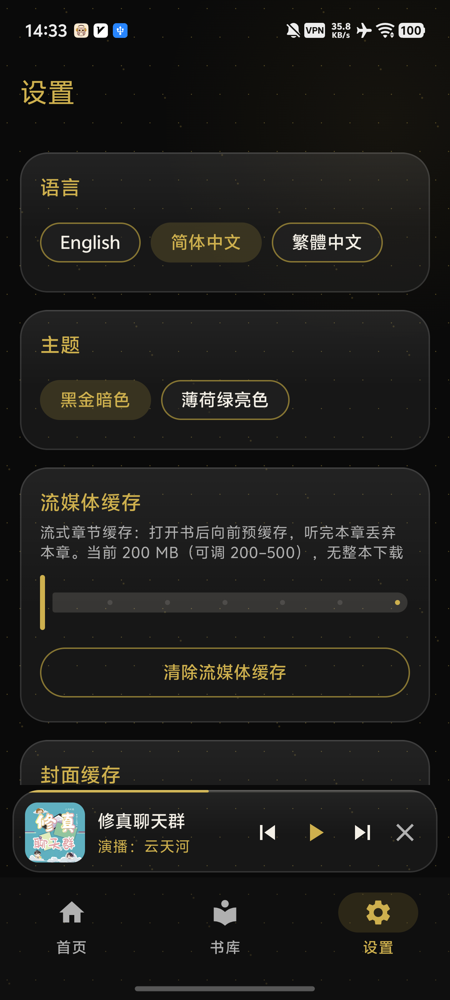

# 悦耳声阅（YueErShengYue）

<p align="center">
  <a href="README.md">English</a> · <strong>简体中文</strong>
</p>

**悦耳声阅**是一款面向 **Android 与 Windows** 的 [Audiobookshelf](https://www.audiobookshelf.org/) 客户端，提供简洁的有声书体验，包括流媒体播放、书库浏览与进度同步。

**当前稳定版：1.0.0** — Android `versionCode` 为 **33**，Windows 便携版使用相同版本号。

---

## 支持平台

| 平台 | 软件包 | 系统要求 | 文件名 |
|------|--------|----------|--------|
| **Android** | 正式签名 APK | Android 8.0+（API **26**），`targetSdk` **35** | `YueErShengYue-1.0.0-release.apk` |
| **Windows** | x86_64 便携包 | 64 位 Windows；内置运行时 | `YueErShengYue-Windows-x86_64-Portable-1.0.0.zip` |

| 标识 | 值 |
|------|----|
| applicationId / 包名 | `com.yueer.shengyue` |
| 版本名称 | `1.0.0` |
| Android 版本代码 | `33` |
| Android minSdk / targetSdk | **26** / **35** |

---

## 下载与安装

正式发布页：**[悦耳声阅 1.0.0](https://github.com/huliyoudiangou/YueErShengYue_APP/releases/tag/v1.0.0)**

### 直接下载

| 平台 | 下载 |
|------|------|
| Android | [YueErShengYue-1.0.0-release.apk](https://github.com/huliyoudiangou/YueErShengYue_APP/releases/download/v1.0.0/YueErShengYue-1.0.0-release.apk) |
| Windows x86_64 | [YueErShengYue-Windows-x86_64-Portable-1.0.0.zip](https://github.com/huliyoudiangou/YueErShengYue_APP/releases/download/v1.0.0/YueErShengYue-Windows-x86_64-Portable-1.0.0.zip) |

### Android

1. 下载 `YueErShengYue-1.0.0-release.apk`。
2. 使用下方 SHA-256 校验文件。
3. 在设备上打开 APK；若 Android 请求授权此来源安装应用，请在系统设置中允许。
4. 启动悦耳声阅，选择语言，填写 Audiobookshelf 服务器地址和账号信息，然后登录。

### Windows 便携版

1. 下载 `YueErShengYue-Windows-x86_64-Portable-1.0.0.zip`。
2. 使用下方 SHA-256 校验文件。
3. 将压缩包解压到本地目录，建议使用路径较短且具备常规写入权限的位置。
4. 运行 `YueErShengYue.exe`。请保持 `app/`、`runtime/` 及相关文件原有的相对目录结构。

---

## SHA-256 校验

| 文件 | SHA-256 |
|------|---------|
| `YueErShengYue-1.0.0-release.apk` | `695ADF9D1D3B4560E6697FFE20DC1EE8BC29FB1D73983FF35D38DE3E2FF272C2` |
| `YueErShengYue-Windows-x86_64-Portable-1.0.0.zip` | `090048DDAC795419FD06210C1DADD123CD9358397737122B63CF68E20506C7E1` |

PowerShell 示例：

```powershell
Get-FileHash -Algorithm SHA256 .\YueErShengYue-1.0.0-release.apk
Get-FileHash -Algorithm SHA256 .\YueErShengYue-Windows-x86_64-Portable-1.0.0.zip
```

计算结果与上表对应值一致后，再安装或运行软件包。

---

## 1.0.0 更新内容

- **Android 与 Windows 同步首发**，双端版本号一致。
- **Windows 所有页面的鼠标滚轮方向统一**：向下滚动查看下方内容，向上滚动查看上方内容。
- **优化稳定性、响应速度与播放流程**，同时保持现有 UI/UX 布局不变。
- 提供正式签名 Android APK 与自带运行时的 Windows x86_64 便携包。
- 改进播放会话、进度同步与桌面端启动体验。

---

## 功能亮点

### 播放与进度

- 流媒体有声书播放与章节导航。
- **0.5x 至 3.0x** 播放速度，支持全局默认和单书覆盖。
- 睡眠定时预设，以及按书设置片头片尾跳过时长。
- 播放期间约每 **15 秒**同步一次会话进度，并在暂停和停止时更新。
- Android 媒体通知与锁屏控制。

### 书库与发现

- 首页包含继续播放、最近添加、推荐图书、再次收听和我的收藏。
- 封面网格书库浏览、排序、筛选与全局搜索。
- 书籍详情展示封面、演播者、简介、章节和播放控制。
- 推荐内容按本地自然日刷新，并支持本地缓存和手动刷新。

### 流媒体缓存

- 流媒体缓存可在 **0 至 500 MB** 范围调节，默认 **200 MB**。
- 预缓存当前章节与后续两章。
- 可分别清理封面缓存和流媒体缓存。

### 主题与语言

- 黑金暗色主题与薄荷绿亮色主题。
- **English、简体中文、繁體中文**界面。
- 针对窄屏和长屏优化的响应式布局。

### Android 与 Windows 体验

- Android Auto 媒体库浏览与播放集成。
- Windows 便携分发包内置运行时。
- Windows 各页面采用统一的鼠标滚轮方向。

---

## 界面预览

| 首页 | 书籍详情 |
|:----:|:--------:|
|  |  |

| 播放页 | 书库 |
|:------:|:----:|
|  |  |

| 设置 |
|:----:|
|  |

截图展示的主题或语言可能因设备配置而异。

---

## 开始使用

1. 安装 Android APK，或解压 Windows 便携包。
2. 打开悦耳声阅并选择界面语言。
3. 选择 `https://` 或 `http://`，然后填写主机、端口、用户名和密码。
4. 浏览首页或书库，打开一本书并开始播放。
5. 在播放页切换章节、调节速度、设置睡眠定时和单书播放选项。
6. 在设置中调整主题、语言、默认速度和缓存大小。

### 服务器地址填写

- 从协议菜单选择协议。
- 在主机栏填写域名或 IP 地址。
- 填写服务器端口；HTTPS 默认端口为 `443`。
- 粘贴完整 URL 时，应用会自动识别并拆分协议与主机信息。

---

## 版本历史

| 版本 | 摘要 |
|------|------|
| **1.0.0** | Android 与 Windows 同步首发；统一 Windows 滚轮体验；稳定性与性能优化 |
| 0.7.x | 双端版本对齐与正式发布加固 |
| 0.5.5 | 全局播放速度行为与每日推荐刷新 |
| 0.1.0-mvp | 初始应用流程与 Audiobookshelf 集成 |

已发布的软件包请查看 [GitHub Releases](https://github.com/huliyoudiangou/YueErShengYue_APP/releases)。

---

## 反馈

| | |
|---|---|
| 作者 | **makizhang** |
| 反馈渠道 | Telegram [@makichat_bot](https://t.me/makichat_bot) |

反馈安装、登录或播放问题时，请附上平台、系统版本、服务器版本和现象简述。

---

<p align="center">悦耳声阅 · 用耳朵丈量世界</p>
